 


# Érzékelés

Az érzékelés nyers adatok beolvasását jelenti.

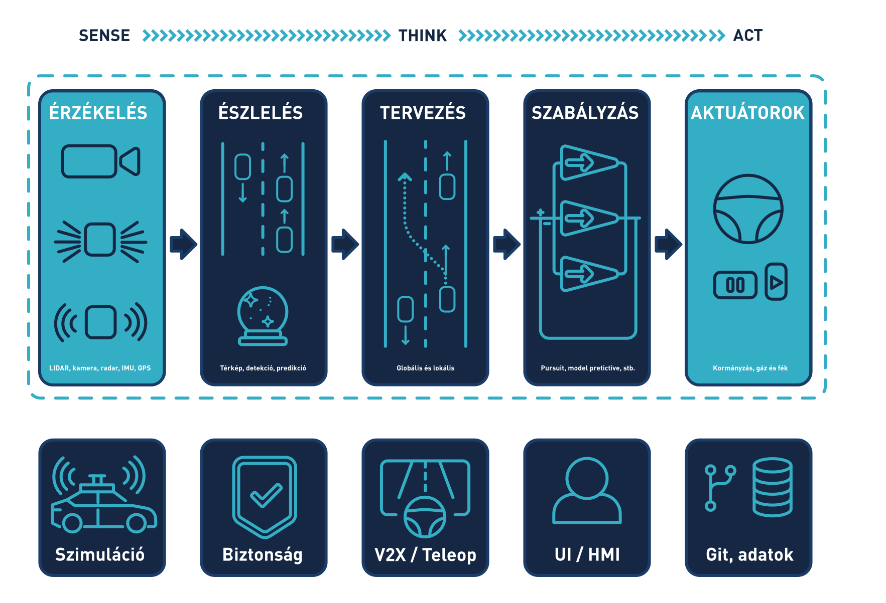

Érzékelés esetében fontos felhívi a figyelmet, hogy ez még nem jelent magas szintű adatfeldolgozást. Szenzorai lehetnek kamerák, mikrofonok, LIDAR-ok stb. Ahogy az ábra is mutatja a tananyagban az érzékeléssel együtt tárgyaljuk az aktuálást is.

!!! note
    Magyar nyelven könnyű összekeverni az érzékelés (sensing) és az észlelés (perception) foglamakat. Az érzékelés egyszerű driver szintű nyers adatok előállításával foglakozik.


!!! question "Ellenőrző kérdések"
    - Melyik ROS verziót használjuk? 
    - Mi a topic? Milyen típusú üzenetekről volt szó?
    - Mi a node?
    - Mi az a publisher és a subscriber?

## Kamera

A kamera az érzékelőjére (pl CCD CMOS szenzor) érkező fényt elektronikus jellé alakítja, digitálisan. Megkülönböztethetünk mono, sztereo vagy mélységérzékelésre képes kamerákat is.

- *Jellemző gyártók:* Allied Vision, Basler, Stereolabs, Orbbec, Intel
- *Jellemző interfész:* GigE, USB3
- *Jellemző `ROS 2` topic típusok:* [`sensor_msgs/msg/Image`](https://github.com/ros2/common_interfaces/blob/humble/sensor_msgs/msg/Image.msg), [`sensor_msgs/msg/CameraInfo`](https://github.com/ros2/common_interfaces/blob/humble/sensor_msgs/msg/CameraInfo.msg)

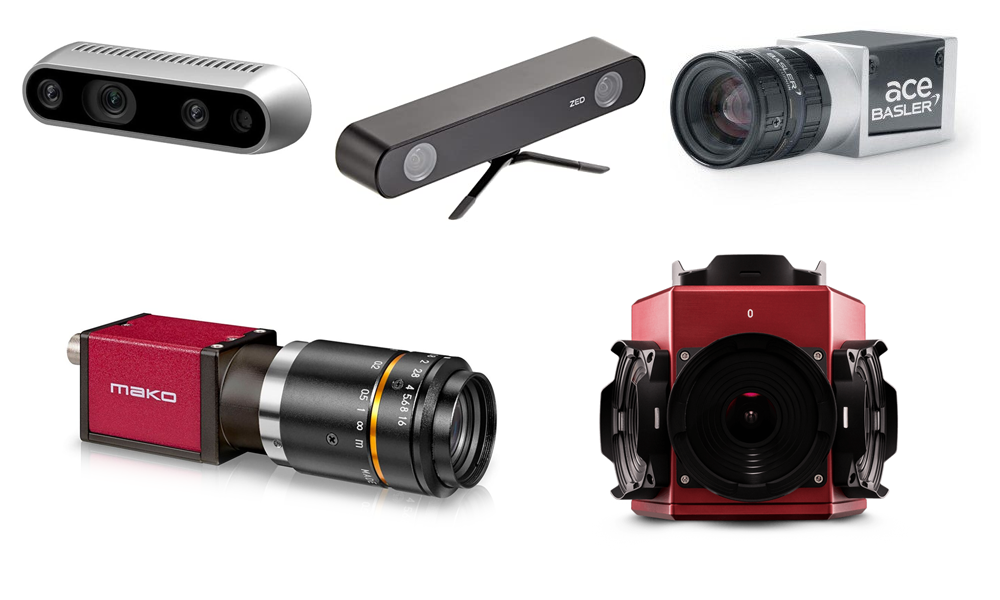

#### Mélységesztimáció:

<iframe width="560" height="315" src="https://www.youtube.com/embed/NZZIPcBBAc8?si=prA7yVUnzcK2szQU" title="YouTube video player" frameborder="0" allow="accelerometer; autoplay; clipboard-write; encrypted-media; gyroscope; picture-in-picture; web-share" referrerpolicy="strict-origin-when-cross-origin" allowfullscreen></iframe>
--- 

#### Lokalizáció kamerával:

<iframe width="560" height="315" src="https://www.youtube.com/embed/Eaf6r_BNFfk?si=KxoCWP2M8S6BBOui" title="YouTube video player" frameborder="0" allow="accelerometer; autoplay; clipboard-write; encrypted-media; gyroscope; picture-in-picture; web-share" referrerpolicy="strict-origin-when-cross-origin" allowfullscreen></iframe>
---
### SZEnergy szenzor
A SZEmission az elmúlt években egy *Stereolabs Zed2i* sztereokamerával volt felszerelve.

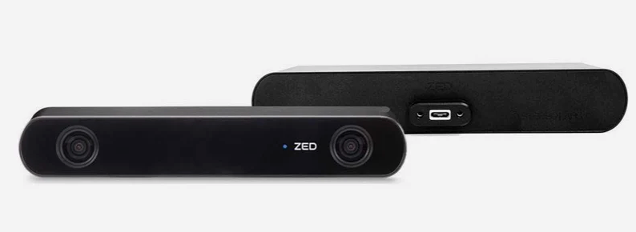

- **Kettős RGB szenzor:** Akár 120°-os nagylátószögű látómező a szélesebb környezeti lefedettségért.
- **MI alapú térérzékelés:** Neurális mélységérzékelés, 3D térképezés és precíz térbeli objektumfelismerés.
- **Komplex beépített szenzorika:** Újgenerációs IMU, giroszkóp, barométer, magnetométer és hőmérséklet-érzékelő.
- **Masszív kialakítás:** Alumínium váz hőszabályozással, IP66-os víz- és porvédelemmel, valamint biztonságos USB-C csatlakozással.
- **Széleskörű felhasználás:** Ideális autonóm navigációhoz és robotikához, NVIDIA Jetson és más peremhálózati (edge) platformok támogatásával.

!!! note "Hátrányok"
    - Beltéri kamera → meleg időben túlmelegedés
    - Nem HDR kamera → kültéri használat esetén bezavarhatnak a tükröződő, túl fényes vagy sötét részek
    - Nem teljesen testreszabható `topic` be/kikapcsolás → mindig magas adatforgalom

A 2027-es versenyszezonban ezt a kamerát egy robosztusabb, autóiparban használt kamera váltja: **Tier IV C2**

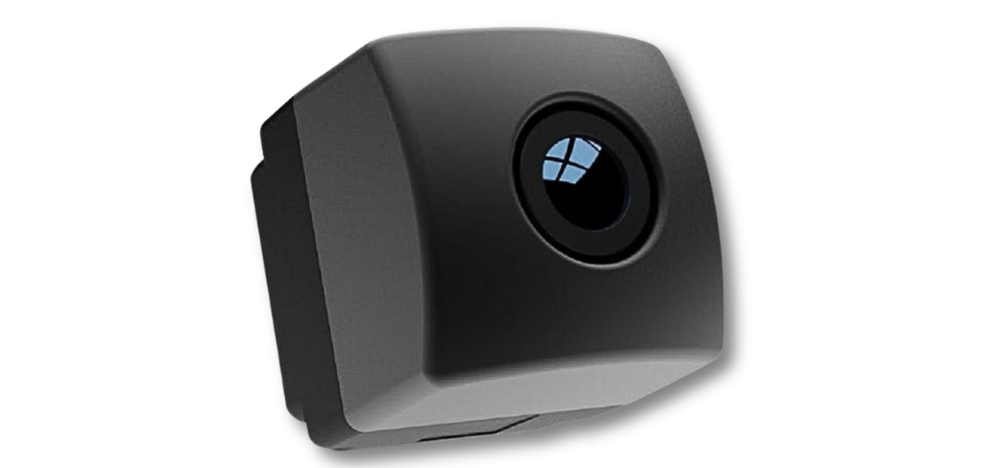

- **Nagy felbontású szenzor:** 5,4MP (Sony IMX490), választható 30°, 120° vagy 176° FOV.
- **Fejlett képalkotás:** 120 dB HDR és LED-villogás szűrés (flicker mitigation).
- **Autóipari kivitel:** IP69K védelem, extrém hőtűrés (-40°C és +85°C között).
- **Önvezetésre fejlesztve:** Autoware, Linux és ROS1/2 ökoszisztéma támogatás.
- **GMSL2 interfész:** Stabil jelátvitel és tápellátás egyetlen koaxiális kábelen (PoC)

## LIDAR

A LIDAR (Light Detection and Ranging) szenzor egy olyan eszköz, amely lézerpulzusokkal és azok visszaverődési idejéből távolságokat képes megállapítani. Az elve hasnoló a lézeres távolságmérőhöz, ám a mérés gyakorisága és frekvenciája is sokkal naygobb annál. Példaképp vegyünk egy forgó 64 csatornás LIDAR-t. Ez jellemzően `10` vagy `20` Hz-en mér, tehát másodpercenként `10` vagy `20` teljes `360°`-os körbefordulást tesz meg. A `64` csatorna azt jelenti, hogy minden pillanatban `64` egymás alatti érzékelő érzékel. Egy körbefordulást jellemzően `512` / `1024` / `2048` mérést jelent csatornánként. Innen ki is számolható a másodpercenkénti mérésadat: pl `20*64*1024 = 1 310 720`. Tehát jellemzően másodpercenként, több mint egymillió 3D pontot mér az eszköz, amihez intenzitás, ambient, reflektív tulajdonságok is társulnak.

- *Jellemző gyártók:* Velodyne, Ouster, Livox, SICK, Hokuy, Pioneer, Luminar, Hesai, Robosense, Ibeo, Innoviz, Quanenergy, Cepton, Blickfeld, Aeva
- *Jellemző interfész:* GigE
- *Jellemző `ROS 2` topic típusok:* [`sensor_msgs/msg/PointCloud2`](https://github.com/ros2/common_interfaces/blob/humble/sensor_msgs/msg/PointCloud2.msg), [`sensor_msgs/msg/LaserScan`](https://github.com/ros2/common_interfaces/blob/humble/sensor_msgs/msg/LaserScan.msg)

LIDAR gyártókat, dataseteket, algoritmusokat tartlamazó gyűjtemény: [github.com/szenergy/awesome-lidar](https://github.com/szenergy/awesome-lidar).

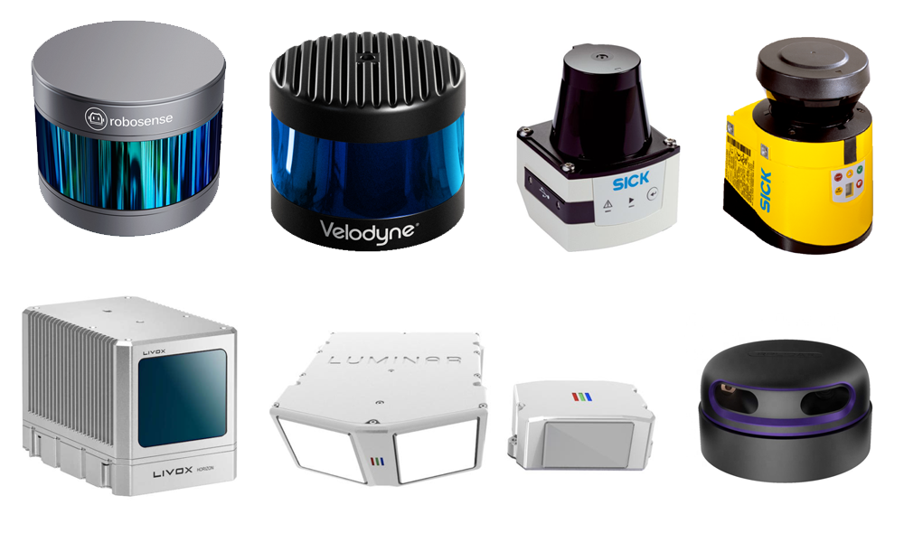

<iframe width="560" height="315" src="https://www.youtube.com/embed/1IWXO0vvmO8?rel=0" title="YouTube video player" frameborder="0" allow="accelerometer; autoplay; clipboard-write; encrypted-media; gyroscope; picture-in-picture; web-share" allowfullscreen></iframe>

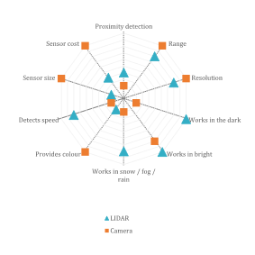

### SZEnergy szenzor
A SZEmission egy 128 csatornás *Ouster OS1-128* LIDART használ.

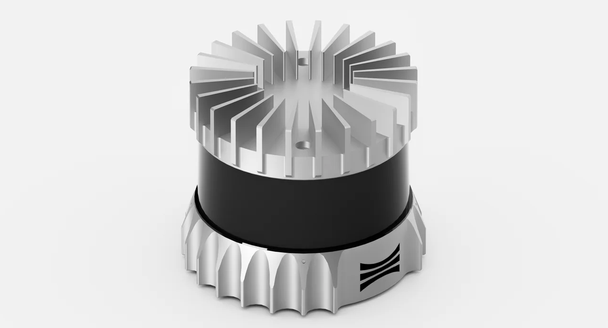

- **Kiemelkedő 3D felbontás:** 128 csatornás függőleges felbontás, amely akár 5,2 millió pont/másodperc sűrűségű, rendkívül részletes pontfelhőt rögzít.
- **Széles látómező és hatótáv:** 360°-os vízszintes és 45°-os függőleges látómező (FOV), verziótól (pl. Rev8) függően akár 200 méteres maximális hatótávolsággal.
- **Kamera szintű képalkotás:** A távolságmérés mellett közeli infravörös (NIR) és fényvisszaverődési adatokat is biztosít, 2D kamera minőségű képet alkotva.
- **Extrém robusztusság:** IP68 és IP69K víz- és porállóság, ütésvédelem, valamint szélsőséges időjárási tűrés (-40°C és +60°C közötti működés).
- **Sokoldalú ipari integráció:** Kompakt méret, saját fejlesztésű L3 chip a jelfeldolgozáshoz, valamint nyílt (ROS/C++) szoftvertámogatás robotikához és önvezetéshez.


## Radar
- *Jellemző gyártók:* Aptiv, Bosch, Continental,  Denso
- *Jellemző interfész:* CAN bus
- *Jellemző `ROS 2` topic típusok:* [`radar_msgs/msg/RadarTrack`](https://github.com/ros-perception/radar_msgs/blob/ros2/msg/RadarTrack.msg)


A LIDAR és a kamera jellemzőinek összehasonlítása


## IMU

Az IMU kis méretű elektromechanikus giroszkópokat és gyorsulásmérőket, valamint jelfeldolgozó processzorokat tartalmazó szenzor. Gyakran kombinálják további szenzorokkal, pl. barometrikus magasságmérővel, magnetométerrel, iránytűvel. Némely GPS (GNSS) rendszerben is megtalálhatók.

- *Jellemző gyártók:* Lord MicroStrain, Bosch, XSens
- *Jellemző interfész:* Serial, Ethernet, USB, CAN bus
- *Jellemző `ROS 2` topic típusok:* [`sensor_msgs/msg/Imu`](https://github.com/ros2/common_interfaces/blob/humble/sensor_msgs/msg/Imu.msg), [`sensor_msgs/msg/MagneticField`](https://github.com/ros2/common_interfaces/blob/humble/sensor_msgs/msg/MagneticField.msg)


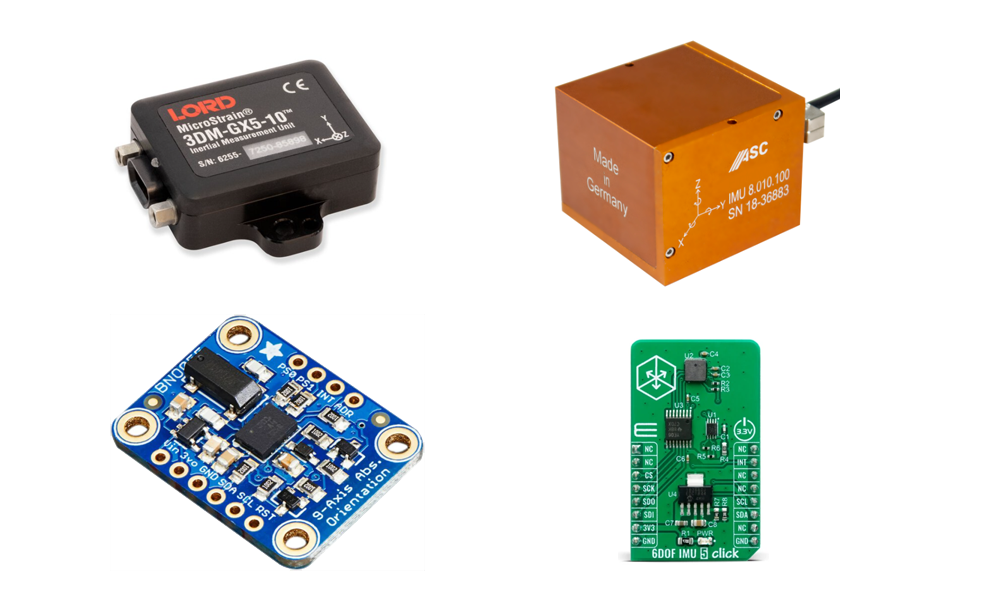


<iframe width="560" height="315" src="https://www.youtube.com/embed/6HxuGmd24u4?si=8QImJAkkbuxq7rNu" title="YouTube video player" frameborder="0" allow="accelerometer; autoplay; clipboard-write; encrypted-media; gyroscope; picture-in-picture; web-share" referrerpolicy="strict-origin-when-cross-origin" allowfullscreen></iframe>

### SZEnergy szenzor
A SZEmission egy *Microstrain LORD IMU*-t használ.

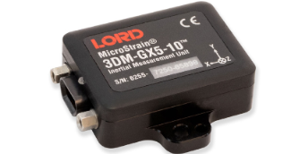

- **Precíz MEMS szenzorok:** Gyárilag kalibrált és kompenzált 3 tengelyes gyorsulásmérő, giroszkóp, magnetométer és barométer.
- **Fejlett Kalman-szűrés:** Beépített EKF/AKF algoritmusok a stabil és pontos térbeli adatokért, még zajos környezetben is.
- **GNSS/GPS integráció:** Műholdas helymeghatározással kiegészített modellek autonóm járművekhez és drónokhoz.
- **Ipari robusztusság:** Kompakt és könnyű kialakítás, kiemelkedő ütés-, rázkódás- és hőtűréssel.
- **Sokoldalú integráció:** Saját MIP adatprotokoll, valamint teljes körű ROS/ROS2 és C++ támogatás.

## GNSS (GPS)

A [GNSS](https://en.wikipedia.org/wiki/Satellite_navigation) (global navigation satellite system) globális szatelit-alapú navigációs rendszert jelent, köznapi szóhasználatban ezt szokás GPS-nek nevezni. Ha pontosak szeretnénk lenni, akkor a GPS csupán az első ilyen technológia ezen kívül létezik még GLONASS, BeiDou, Galileo és QZSS rendszer is, ezek üzemeltetése különböző államokhoz / szövetségekhez kötődik.

- *Jellemző gyártók:* SwiftNavigation, VectorNav, Ublox, NovaTel
- *Jellemző interfész:* GigE, CAN bus
- *Jellemző `ROS 2` topic típusok:* [`sensor_msgs/msg/NavSatFix`](https://github.com/ros2/common_interfaces/blob/humble/sensor_msgs/msg/NavSatFix.msg), [`geometry_msgs/msg/PoseStamped`](https://github.com/ros2/common_interfaces/blob/humble/geometry_msgs/msg/PoseStamped.msg)

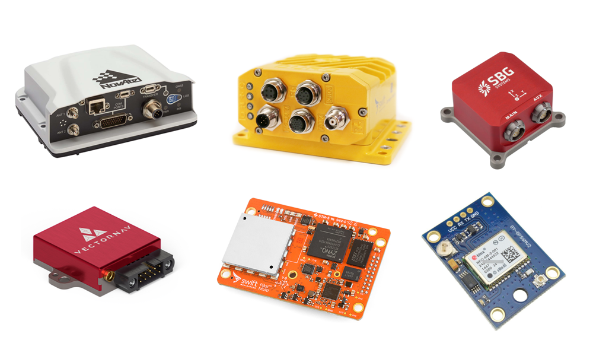

Rövid, de jó leírás a GNSS pontosságról: [www.sbg-systems.com/news/mastering-accurac-gnss-and-its-errors-sources/](https://www.sbg-systems.com/news/mastering-accurac-gnss-and-its-errors-sources/)

<iframe width="560" height="315" src="https://www.youtube.com/embed/Gm-oEbn5nQo?si=fKLiyV6wvU67loeP" title="YouTube video player" frameborder="0" allow="accelerometer; autoplay; clipboard-write; encrypted-media; gyroscope; picture-in-picture; web-share" referrerpolicy="strict-origin-when-cross-origin" allowfullscreen></iframe>

#### Egy antennás és két antennás GNSS
Az egyantennás GPS megmutatja, hol van a jármű, de csak mozgás közben tudja megállapítani, hogy pontosan merre is néz az orra. Ezzel szemben a kétantennás rendszer már álló helyzetben is azonnal tűpontos irányszöget ad, mivel a két antenna egymáshoz viszonyított helyzetéből folyamatosan kiszámolja az irányt. Ez az önvezető járműveknél azért létfontosságú, mert a rendszernek már az elindulás pillanatában, a legelső centiméter megtétele előtt biztosan tudnia kell a pontos haladási irányt.

#### RTK
Az RTK (Real-Time Kinematic) egy olyan helymeghatározó eljárás, amely a hagyományos GPS/GNSS rendszerek többméteres pontatlanságát akár centiméteresre javítja. Ezt úgy éri el, hogy egy földi bázisállomás hálózat segítségével valós időben kiszűri és korrigálja a műholdas jelek torzulásait. Ez azért hatalmas előny, mert lehetővé teszi a drónok, önvezető autók és precíziós mezőgazdasági gépek hajszálpontos, biztonságos navigációját, ahol már pár centi tévedés sem fér bele.

### SZEnergy szenzor
A SZEmission egy Swiftnav Piksi Multi GPS-t használ.

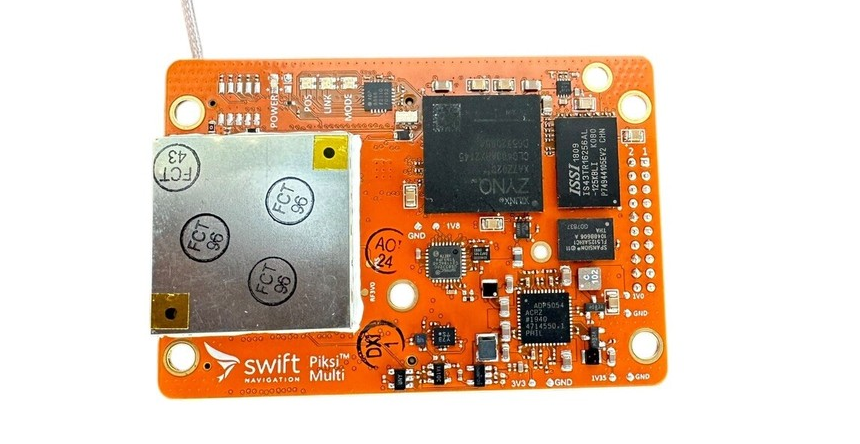

- **Többsávos GNSS-vétel:** L1/L2 frekvenciák és több műholdrendszer (GPS, GLONASS, Galileo, BeiDou) egyidejű követése a maximális lefedettség és robusztus jelvétel érdekében.
- **Centiméteres RTK pontosság:** Valós idejű kinematikus (RTK) helymeghatározás extrém gyors konvergenciával, amely dinamikus környezetben is 1-2 cm-es pontosságot biztosít.
- **Sokoldalú interfészek:** Iparági standard csatlakozások széles skálája (Ethernet, CAN, UART, USB) a zökkenőmentes járműipari vagy robotikai integrációhoz.
- **Kompakt és könnyű kivitel:** Alacsony energiafogyasztású, kis méretű hardver, amely tökéletesen optimalizált drónokhoz (UAV) és súlykritikus autonóm rendszerekhez.
- **Fejlesztőbarát ökoszisztéma:** Teljes körű ROS-támogatás, nyílt forráskódú szoftveres eszközök és a Swift Console grafikus felület az egyszerű beállításhoz és diagnosztikához.

## CAN bus

A CAN bus (Controller Area Network) egy jellemően autóipari szabvány, mely lehetővé teszi a mikrokontrollerek és az eszközök számára, hogy központi egység (host) nélkül kommunikáljanak egymással. Az ethernet kommunkációval összevetve egyszerűbb megvalósítás, alacsonyabb sávszélességű, robosztus.

- Sebesség adat lekérdezése, refencia jel
- Kormányszög adat lekérdezése, refencia jel
- *Jellemző `ROS 2` topic típusok:* [`can_msgs/msg/Frame`](http://docs.ros.org/en/noetic/api/can_msgs/html/msg/Frame.html), [`geometry_msgs/msg/Twist`](https://github.com/ros2/common_interfaces/blob/humble/geometry_msgs/msg/Twist.msg)

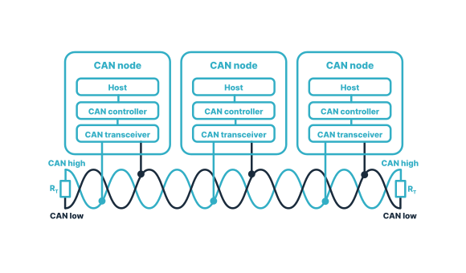

# `ROS 2` időkezelés

Az `ROS` idő kezelésre a Unix-időt, vagy a POSIX-időt használja. Ez a UTC (greenwichi idő) szerinti 1970. január 1. 00:00:00 óta eltelt másodpercek és nanoszekundumok számát jelenti (`int32 sec`, `int32 nsec`). Ez egyrészt relatív kis helyet foglal a memóriában, másrészt könnyen számolható két időpont között eltelt idő, mégpedig egy egyszerű kivonással. 

[ros2time.ipynb :simple-python:](https://github.com/sze-info/szenergy-autonom/blob/main/docs/erzekeles/ros2time.ipynb){: .md-button } 

Hátránya, hogy nem túl intuitív, nem olvasható az ember számára. Pl. a Foxglove Studio ezért is gyakran átalakítja olvashatóbb formátumra. 

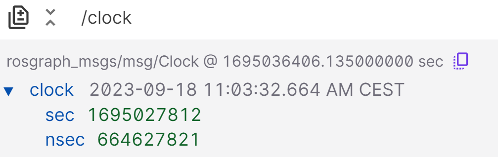

A másodpercek és nanoszekundumok a következőképp képzelhetők el:

``` py
import rclpy
current_time = node.get_clock().now()
print(current_time.to_msg())

Output: 
sec=1694595162, nanosec=945886859
```

Az időbélyeg több helyen is szerepet kap:

``` r
ros2 topic echo /clock --once
clock:
  sec: 1689687476
  nanosec: 770421827
``` 

``` r
ros2 topic echo --once /lexus3/gps/duro/current_pose

header:
  stamp:
    sec: 1694595162
    nanosec: 945886859
  frame_id: map
pose:
  position:
    x: 640142.9676535318
    y: 5193606.439717201
    z: 1.7999999523162842
  orientation:
    x: 0.008532664424537166
    y: 0.0018914791588597107
    z: 0.44068499630505714
    w: 0.8976192678279703
```

Ha szeretnénk átválatni a másodperceket és nanoszekundumokat, azt a következő módon tehetjük meg:

``` py
from datetime import datetime
current_time_float = current_time.to_msg().sec + current_time.to_msg().nanosec / 1e9 # 1e9 is 1,000,000,000: nanosec to sec
print("As a float:\t%.5f" % (current_time_float))
print("ISO format:", end="\t")
print(datetime.utcfromtimestamp(current_time_float).isoformat())


Output:
As a float:	1694595162.94589
ISO format:	2023-09-13T08:52:42.945887
```

# Források


- [Szenzorok ROS-ben](https://docs.google.com/presentation/d/e/2PACX-1vQbXSe4cb-aYgWNNiUF1PHJBZrwl0keWantbFjTe94zm1A9cVGqmWKC4lHCSUr4y7vfq1PrJ2mP8XqP/pub?start=false&loop=false&delayms=3000) _(online google prezentáció magyarul)_
- [docs.ros.org/en/humble/Tutorials/Beginner-CLI-Tools/Understanding-ROS2-Topics/Understanding-ROS2-Topics.html](https://docs.ros.org/en/humble/Tutorials/Beginner-CLI-Tools/Understanding-ROS2-Topics/Understanding-ROS2-Topics.html)
- [autowarefoundation.github.io/autoware-documentation/main/reference-hw/](https://autowarefoundation.github.io/autoware-documentation/main/reference-hw/)

